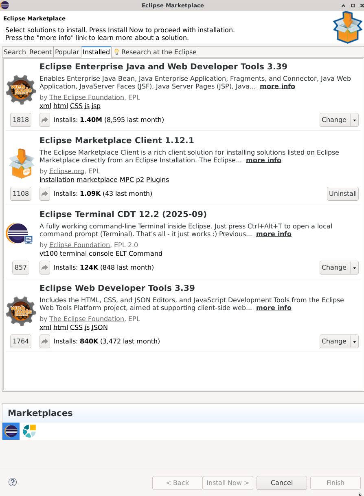

# Java Native Interface (JNI)

## Scripts

```sh
nix-shell --run bash
```

## General

- JNI - is a mechanism that provides the bridge to call functions from the native libraries
  - Windows - `.dll`, Linux - `.so`, Mac - `.dylib`

- E.g. of native libraries:
  - GNU Scientific library

## How to use native code in java?

- Define a class with native methods
- Compile with `javac`
- Generate header files with `javah`(java 8 and below) or `javac -h`(java 9 and above)
- Write C/C++ implementation for that header file
- Compile as dynamic library (Windows - `.dll`, Linux - `.so`, Mac - `.dylib`)
- Add the jvm argument `-Djava.library.path=path/to/library` when running java
- Load library:

  ```java
    static {
      Syste,.loadLibrary("libraryName");
    }
  ```

- Naming MacOS, when using `System.loadLibrary("libqwerty.dylib")`
  - drop `lib` prefix
  - drop `.dylib` suffix
  - Correct: `System.loadLibrary("qwerty")`

## Set Up C++ Compiler

- Mac - XCode or command line tools
- Linux - g++ or clang
- Windows - MinGW-64bit

## General types of parameters

- `JNIEnv` pointer to JNIEnv object used to call java classes and their instance variables
- Primitives: `jint`, `jdouble`, `jboolean`, `jchar`, ... -> equivalent C/C++ primitive types `typedef`
- Classes: `jstring`, `jclass` is used for reflection
- reference to **this** - `jobject`

## Did you know?

- What is the downside of using JNI?
  - It ties the program to the specific platform / platform independence is loosed
- What is the general format of header functions for native methods?
  - `Java_<package_name>_<Class_name>_<method_name>`
  - `java.lang.Math.sin` -> `Java_java_lang_Math_sin`
- Priority of java's stdout and native's stdout
  - java has priority
- What does **dereference** means?
  - accessing the value that a pointer points to.
- Signature of the `String` type
  - `Ljava/lang/String;`
- Difference between C/C++ char and java's char
  - C/C++ char takes 1 byte
  - Java char takes 2 bytes - `unsigned short`
- What is string internalization
  - A mechanism that allows java to put strings in a pool of reusable objects, e.g. `new String("abc").intern()`
- If env method returns a pointer to the native heap, it MUST be released manually, e.g.
  - `const char *str1 = (env)->GetStringUTFChars(param1, 0);`
  - `(env)->ReleaseStringUTFChars(param1, str1);`
- Where is the metadata of Java classes stored in memory?
  - In the Metaspace (formerly known as PermGen).
- What is the difference between java heap and native heap in the context of JNI?
  - java heap is managed by GC while native heap is managed manually
- Java requires `field.setAccessible(true)` in order to access a private field
  - JNI uses unprotected approach, it can easily access private fields

  ```sh
  bash "$PROJECT_ROOT/projects/test1cpp/scripts/build-java-native-class.sh" "$PROJECT_ROOT/projects/test1java/src" "$PROJECT_ROOT/projects/test1cpp/src/jni"

  # bash "$PROJECT_ROOT/projects/test1cpp/scripts/build-so.sh" "$PROJECT_ROOT/projects/test1cpp/src/jni" "$PROJECT_ROOT/projects/test1java/src/jni"

  g++ -fPIC -shared \
    "$PROJECT_ROOT/projects/test1cpp/src/jni/test1java_TestNative.h" \
    "$PROJECT_ROOT/projects/test1cpp/src/impl.cpp" \
    -o "$PROJECT_ROOT/projects/test1java/src/jni/libimpl.so"

  bash "$PROJECT_ROOT/projects/test1cpp/scripts/build-jar.sh" "test1java.TestNative" "$PROJECT_ROOT/projects/test1java/src" "$PROJECT_ROOT/projects/test1java/build"

  java -jar "$PROJECT_ROOT/projects/test1java/build/TestNative.jar"
  ```

## Eclipse setup - cdt (C Development Tool) & (Enterprise Java Plugin)

- Download (<https://www.eclipse.org/downloads/>)
- Unarchive
- Run installer
- Eclipse with C/C++ development tools
- Open eclipse
- Help -> Eclipse Marketplace -> install: Enterprise Java Plugin
  - 

### In nix shell

```sh
nix-shell ~/Desktop/docubase-documents/Udemy/java-native-interface-in-depth/app.nix --run bash

which g++

~/IDEAs/eclipse-cdt/eclipse/eclipse
```

### Env variable required by eclipse

See `app.nix`

```sh
export PATH=/nix/store/abcd1234-gcc-13.2.0/bin:$PATH
export CC=/nix/store/abcd1234-gcc-13.2.0/bin/gcc
export CXX=/nix/store/abcd1234-gcc-13.2.0/bin/g++
export C_INCLUDE_PATH=/nix/store/abcd1234-glibc-2.39/include
export CPLUS_INCLUDE_PATH=/nix/store/abcd1234-gcc-13.2.0/include/c++/13.2.0:/nix/store/abcd1234-gcc-13.2.0/include/c++/13.2.0/x86_64-unknown-linux-gnu
```

### Project 1

- `nix-shell ~/Desktop/docubase-documents/Udemy/java-native-interface-in-depth/app.nix --run bash`
- `cd Udemy/java-native-interface-in-depth`

## VSCodium setup

- 
- add `clangd` language server - part of `clang-tools` package

## References

- <https://github.com/adamheinrich/native-utils/blob/master/src/main/java/cz/adamh/utils/NativeUtils.java>
- <https://www.reddit.com/r/vsCodium/comments/w9kaag/what_is_the_equivalent_of_the_ms_c_extension_with/>

## TODO

- Use plugins for eclipse or intellij that show bytecode of source code
